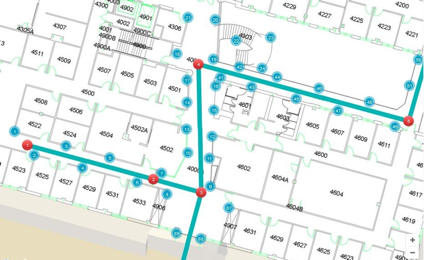
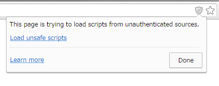
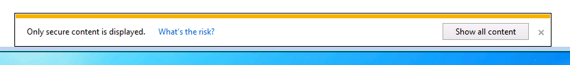
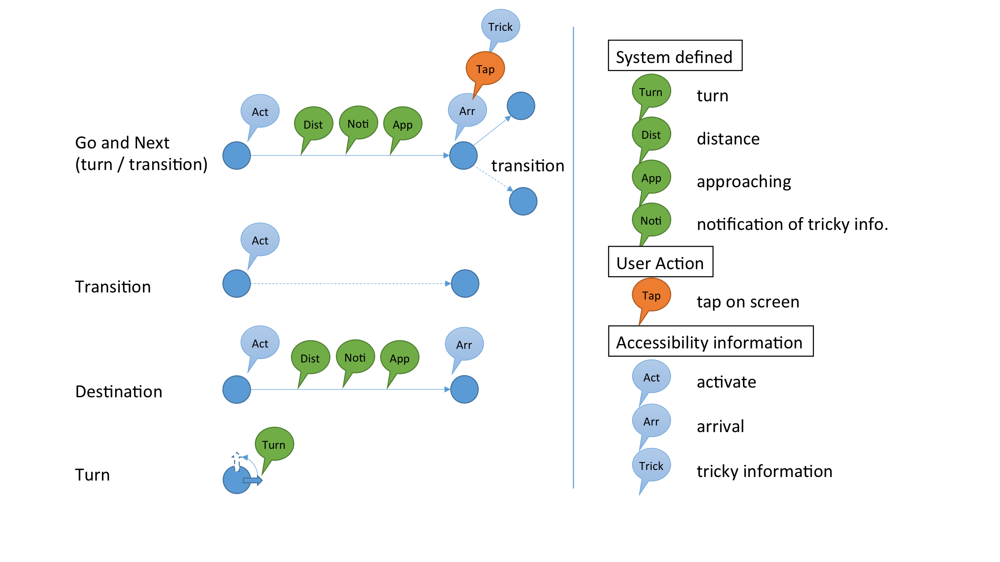

<!--
The MIT License (MIT)

Copyright (c) 2014, 2015 IBM Corporation
Permission is hereby granted, free of charge, to any person obtaining a copy
of this software and associated documentation files (the "Software"), to deal
in the Software without restriction, including without limitation the rights
to use, copy, modify, merge, publish, distribute, sublicense, and/or sell
copies of the Software, and to permit persons to whom the Software is
furnished to do so, subject to the following conditions:

The above copyright notice and this permission notice shall be included in all
copies or substantial portions of the Software.

THE SOFTWARE IS PROVIDED "AS IS", WITHOUT WARRANTY OF ANY KIND, EXPRESS OR
IMPLIED, INCLUDING BUT NOT LIMITED TO THE WARRANTIES OF MERCHANTABILITY,
FITNESS FOR A PARTICULAR PURPOSE AND NONINFRINGEMENT. IN NO EVENT SHALL THE
AUTHORS OR COPYRIGHT HOLDERS BE LIABLE FOR ANY CLAIM, DAMAGES OR OTHER
LIABILITY, WHETHER IN AN ACTION OF CONTRACT, TORT OR OTHERWISE, ARISING FROM,
OUT OF OR IN CONNECTION WITH THE SOFTWARE OR THE USE OR OTHER DEALINGS IN THE
SOFTWARE.
-->

# Edit Map & Routes
This section describes how to design routes and edit maps with accessibility information to provide accessible navigation for blind users with NavCog app.

What you have to do is to edit routes information on [online mapeditor](https://navcog.mybluemix.net/map) and to distribute BLE beacons aroud your routes for localization.

If you had completed to test your navigation with your map, you can submit the map NavCog project members to put them as a [public map](https://navcog.mybluemix.net/maps.html) for the NavCog app.

Here is an example of map in CMU campus.

**CAUTION**: If you use Google Chroome, or Internet Explorer, please accept following message to use online mapeditor.

## Add Area
1. Select `Map` Tab.
2. Add **Layer**

  Layer is a concept of same level of ground to show same level height floor plan images. Sometimes a certain floor of a building is connected to different floor of another building because of ground level difference and so on. You need to add at least one layer to the map by clicking `Add Layer` button with filling z-index of the layer. Usually you can specify the floor number to the z-index value. (2nd floor = 2)

3. Add **Region** to the **Layer**

  Then you can add regions to the selected layer. A region represents a floor plan image. To add a region, you need to move the map to the location where your building is located. If you click on the map, you can see the **Latitude** and **Longitude** coordination of the point in the left side view. Please select your floor plan from your local computer and specify the **Region name** of the floor (usually “building name #F” is convenient). If you click `Add New Region` button, the specified floor plan image will be shown at the specified point.

4. Adjust the **Region** size, rotate, and location

  You can adjust the position, size, and rotation of the floor.
It should not be located exact location of your building in the map. You can roughly locate your floor plan image on the map.

**CAUTION**: Currently nodes and edges location is not associated with region. So you should not change the region position, size, and rotation after you have added nodes and edges.

## Add Node
1. Select `Toology` tab.
2. `Click` on the map where you want to an add node with pressing `a key`.

  Usually, nodes are located at intersection, door, staircase, elevator, and destination locations.

### Node Information
* **Type**

| Type   | Description|
|--------|------------|
| `Normal` | Usually node is this type. |
| `Door`, `Stair`, `Elevator` | Set if the node is in front of these features in your environment. This will be used for transition (see [Appendix](appendix.md#transition).) |
|`Destination`|NavCog app shows a list of Destination node. |

* **Name**
    This will use for destination list and navigation.

* **ID**
    Automatically assigned

* **Building Name**

    You can select a building name from the building list. Selected building name is specified when the node is created.

* **Floor**

    Floor number of the node (some times different from layer z-index)

* **Coordinates in Edge #**

	Automatically assigned from edge information

* **Info needed when coming from this Edge #**
    This information will be announced when user is reached to the node through Edge #

* **Destination Information when coming from this Edge**

    The app will read when the user approaching to the node.

* **Tricky node info from this Edge**

    If you want to announce longer description about around the node. For example a node is located at complex intersection. You may want to provide tricky hint to find their way. NavCog app notify users of existence of tricky information when the user going to be reached to the node through the edge by alert sound. User can listen the information by clicking a button on the screen or to tap designated Bluetooth button device. (Appendix xx

* **Transit to Layer #**
    Select a destination node on the selected layer. You can specify transition for each destination layer. (See [Appendix](appendix.md#transition)
* **Enable transit to Node # with Info**
    App read this information when the system tries to navigate the user to this transition

* **Using target kNN Dist # and Pos #**

    kNN Dist = 0.2 and Pos = 5 (ft) is default value. Check [Appendix](appendix.md#transition) if navigation is not work well in transition.

## Add Edge

1. `Click` on a node where you want to add with pressing `s key`
2. `Click` on another node.

   Edge represents a connection between two nodes and has a fingerprinting data for better localization.

### Edge Information
* **ID**
    Automatically assigned

* **Length (ft)**

    Automatically assigned but you need to measure the actual length of the edge in your real environment.

* **Orientation (degree)**

    You should specify absolute orientation of the edge. Angle is in clockwise.

    * **North** : 0 degree
    * **East** : 90 degree (-270 degree)
    * **South** : 180 degree (-180 degree)
    * **West** : 270 degree (-90 degree)

    You don’t need to measure accurate orientation of the edge because the system use just difference between two edge’s orientations when it navigate the user from edge to edge. In this case several degree of error is not so critical for the navigation.

* **Start From (x, y)**
* **To End (x, y)**

    Specify the coordination of the start and the end point. Usually it has some set back. For example, the length of the edge is 100 feet then start:(0, 9) and end:(0, 109) will be set. (See [Fingerprinting](beacon.md#fingerprinting) section)

* **Min KnnDist**, **Max KnnDist**

    [See Appendix](Appedix.md#knnDist)

* **Data File**

    Specify the sampling data for this edge

* **Info needed when coming from node #**

   App will read this information when the navigation state is changed from the start node to the edge.

## Add Accessibility Information

App provides only directional information such as “turn right and go thirty ft”. Sometimes it is not enough to navigate blind people in the real environment. You can edit additional navigation command for each node and edge.
You can add accessibility information for specific timing in navigation state.

### Navigation states and accessibility information

Item|Timing
---|---
[**Info needed when coming from this Edge #**](#acc_info1)|`Go and Next - Arrival`
[**Destination Information when coming from this Edge**](#acc_info2)|`Destination - Arrival`
[**Tricky node info from this Edge**](#acc_info3)|`Tricky information`
[**Enable transit to Node # with Info**](#acc_info4)|`Transit - Activate`
[**Info needed when coming from node #**](#acc_info5)|`Go and Next - Activate`

## Add Beacon
1. Select `Beacon` tab
2. Choose `Layer`
2. `Click` on the map where you want to add a beacon with pressing `a key`

### Beacon Information
 |description
---|---
UUID|UUID string of the beacon like "f4376677-0906-41a4-b3ab-949bd675e58c"
Major ID|Major ID of the beacon
Minor ID|Minor ID of the beacon
Product ID|You can use as a note
Beacon ID|Automatically assigned

## Export map file

* select **File** tab
* click **Save to Download** button to download the map file (.json file)
