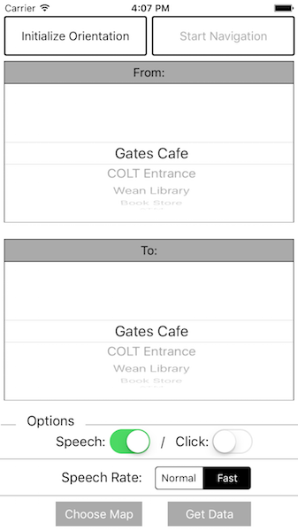

<!--
The MIT License (MIT)

Copyright (c) 2014, 2015 IBM Corporation
Permission is hereby granted, free of charge, to any person obtaining a copy
of this software and associated documentation files (the "Software"), to deal
in the Software without restriction, including without limitation the rights
to use, copy, modify, merge, publish, distribute, sublicense, and/or sell
copies of the Software, and to permit persons to whom the Software is
furnished to do so, subject to the following conditions:

The above copyright notice and this permission notice shall be included in all
copies or substantial portions of the Software.

THE SOFTWARE IS PROVIDED "AS IS", WITHOUT WARRANTY OF ANY KIND, EXPRESS OR
IMPLIED, INCLUDING BUT NOT LIMITED TO THE WARRANTIES OF MERCHANTABILITY,
FITNESS FOR A PARTICULAR PURPOSE AND NONINFRINGEMENT. IN NO EVENT SHALL THE
AUTHORS OR COPYRIGHT HOLDERS BE LIABLE FOR ANY CLAIM, DAMAGES OR OTHER
LIABILITY, WHETHER IN AN ACTION OF CONTRACT, TORT OR OTHERWISE, ARISING FROM,
OUT OF OR IN CONNECTION WITH THE SOFTWARE OR THE USE OR OTHER DEALINGS IN THE
SOFTWARE.
-->

# NavCog User Guide

## Usage of NavCog
1. Tap “Choose Map” to show available navigation maps
2. Tap “Update” to update map list
3. Select the map where you are -> wait for loading (a few seconds)
4. Set the current place to “From” and the destination to “To”
5. Head to North and tap “Initialize Orientation”
6. Tap “Start Navigation” to start navigation

## Select Map View
Please select a map from the list.
There are maps in the public map list and maps in a private map.

### Update button
Download the latest public map list from the NavCog server and update the list.

## Route Setting View

### Initialize Orientation button
You need to initialize orientation for the first use. Please ask your admin how to set the orientation.

### Start Navigation button
Start navigation from **from** place to **to** place.

### From, To picker
Please select your start location and destination.

### Speech option
Speak navigation command

### Click option
Provide click sound for navigation

### Speech rate
You can change speech rate as Normal / Fast

### Choose Map button
You can change the map
