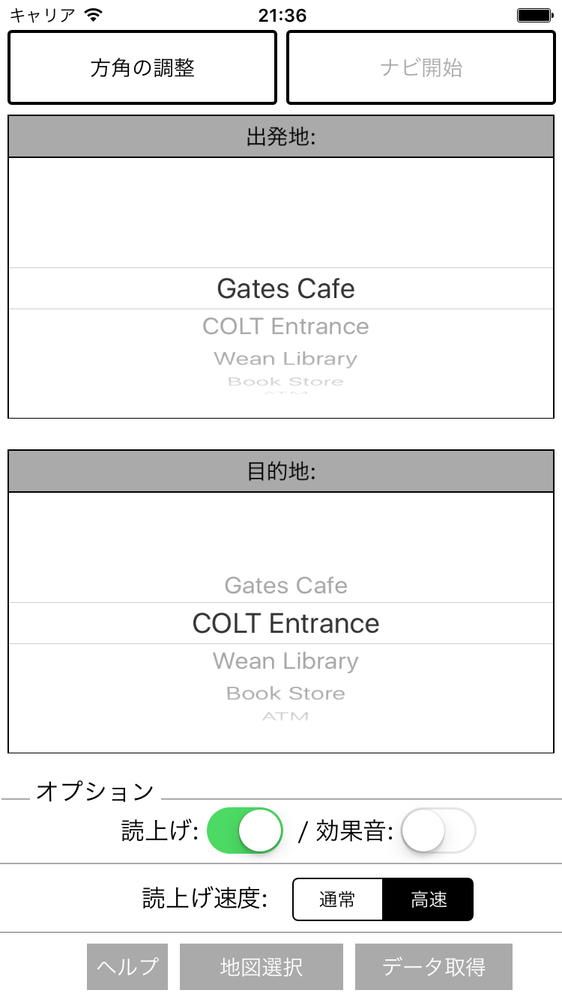

<!--
The MIT License (MIT)

Copyright (c) 2014, 2015 IBM Corporation
Permission is hereby granted, free of charge, to any person obtaining a copy
of this software and associated documentation files (the "Software"), to deal
in the Software without restriction, including without limitation the rights
to use, copy, modify, merge, publish, distribute, sublicense, and/or sell
copies of the Software, and to permit persons to whom the Software is
furnished to do so, subject to the following conditions:

The above copyright notice and this permission notice shall be included in all
copies or substantial portions of the Software.

THE SOFTWARE IS PROVIDED "AS IS", WITHOUT WARRANTY OF ANY KIND, EXPRESS OR
IMPLIED, INCLUDING BUT NOT LIMITED TO THE WARRANTIES OF MERCHANTABILITY,
FITNESS FOR A PARTICULAR PURPOSE AND NONINFRINGEMENT. IN NO EVENT SHALL THE
AUTHORS OR COPYRIGHT HOLDERS BE LIABLE FOR ANY CLAIM, DAMAGES OR OTHER
LIABILITY, WHETHER IN AN ACTION OF CONTRACT, TORT OR OTHERWISE, ARISING FROM,
OUT OF OR IN CONNECTION WITH THE SOFTWARE OR THE USE OR OTHER DEALINGS IN THE
SOFTWARE.
-->

# NavCogユーザー・ガイド

## NavCogの使い方
1. `地図選択`をタップして、利用可能なナビゲーション用地図のリストの選択画面へを表示
2. `更新`をタップして、リストを更新
3. 今居る場所の地図を選択（→地図にロードに数秒かかる）
4. 「出発地」に今居る場所を、「目的地」に目的地を設定
5. 真北の方角を向いて、`方角の調整`ボタンをタップ
6. `ナビ開始`ボタンをタップして、ナビゲーションを開始

## 地図選択画面
リストからナビゲーションしてほしい地図を選択します。([*1](#footnote1))

### 更新ボタン
最新の公開地図のリストをサーバからダウンロードして更新します。

## ルート設定画面（メイン画面）

### 方角の調整ボタン
真北の方角を向いてボタンを押すことで、アプリに正しい方角を設定します。方角の調整は、毎回ナビゲーション開始前に実施する必要があります。

### ナビ開始ボタン
設定した出発地から目的地までのナビゲーションを開始します。

### 出発地、目的地選択
今居る場所と目的地をそれぞれ選択します。

### 読上げスイッチ
音声読み上げのオン・オフを指定します。

### 効果音スイッチ
ナビゲーション中にクリック音を鳴らすかどうかを指定します。

### 読上げ速度
通常 / 高速 を選択できます。

### 地図選択ボタン
地図をはじめに選択する場合は、別の地図に変更する場合に利用します。

<a name="footnote1">*1</a>: 地図には公開地図（オンラインで公開されている地図）と、プライベート地図（iTunes経由で独自に追加した地図）の二種類があります
