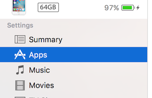

<!--
The MIT License (MIT)

Copyright (c) 2014, 2015 IBM Corporation
Permission is hereby granted, free of charge, to any person obtaining a copy
of this software and associated documentation files (the "Software"), to deal
in the Software without restriction, including without limitation the rights
to use, copy, modify, merge, publish, distribute, sublicense, and/or sell
copies of the Software, and to permit persons to whom the Software is
furnished to do so, subject to the following conditions:

The above copyright notice and this permission notice shall be included in all
copies or substantial portions of the Software.

THE SOFTWARE IS PROVIDED "AS IS", WITHOUT WARRANTY OF ANY KIND, EXPRESS OR
IMPLIED, INCLUDING BUT NOT LIMITED TO THE WARRANTIES OF MERCHANTABILITY,
FITNESS FOR A PARTICULAR PURPOSE AND NONINFRINGEMENT. IN NO EVENT SHALL THE
AUTHORS OR COPYRIGHT HOLDERS BE LIABLE FOR ANY CLAIM, DAMAGES OR OTHER
LIABILITY, WHETHER IN AN ACTION OF CONTRACT, TORT OR OTHERWISE, ARISING FROM,
OUT OF OR IN CONNECTION WITH THE SOFTWARE OR THE USE OR OTHER DEALINGS IN THE
SOFTWARE.
-->

# ナビゲーション用地図のテスト（検証）


## 地図リストファイルの準備

NavCogアプリの地図リストに作成した地図を表示するために、地図リストファイル（**JSON**フォーマット）を準備する必要があります。

下例のように、**maps**のリストに表示する地図の情報を記述します。**name**とJSONファイル名を同じにする必要があります。
（下例の場合、ファイル名は**Sample Map.json**とする必要があります）

```
{
  "title": "NavCog Private Map Data List",
  "maps": [
    {
      "name": "Sample Map"
    }
  ]
}
```

## ナビゲーション用地図データをiPhoneにコピー
1. iPhoneをMacにUSB接続
2. iTunesを開き、 iPhoneマークを選択
3. 「アプリ」を選択

    
4. 「ファイル共有」より、NavCogアプリを探して選択する
5. 「追加」ボタンをクリックして、地図リストファイルとナビゲーション用地図ファイルを選択し、追加する

 【注意】もし同名のファイルが既に存在する場合、まず先にそのファイルを削除してから実行してください（ファイルを選択して**delete**キーで削除できます）


## NavCogアプリを使ってテスト
ナビゲーション用地図のテスト内容と、うまく行かなかった場合など、確認すべき設定箇所は下記のとおりです。

|テスト内容|確認すべき設定箇所|
|---|---|
|位置推定精度 (average error) が  7 フィート以下であること|[基準測定](beacon.md#fingerprinting)データに不備がないか、[エッジ](map.md#add_edge)座標が正しく設定されているか|
|ナビゲーション中に期待通りの情報が読上げられること|[アクセシビリティ情報](map.md#add_acc_info)が正しく設定されているか [エッジ](map.md#add_edge)の方角が間違っていないか|
|（遷移を設定した場合）ノードの遷移が正しく行われること|[ノードの遷移](appendix.md#transition)に必要な情報が正しく設定されているか|


## ナビゲーション用地図を公開
上記、テストを実施して問題がなければ、その地図を[public map](https://navcog.mybluemix.net/index.html#public_maps)として、NavCogプロジェクトメンバーに公開することができます。

地図を公開したい場合、その旨 [NavCogサポート](mailto:navcog.calab@gmail.com) までご連絡ください。
